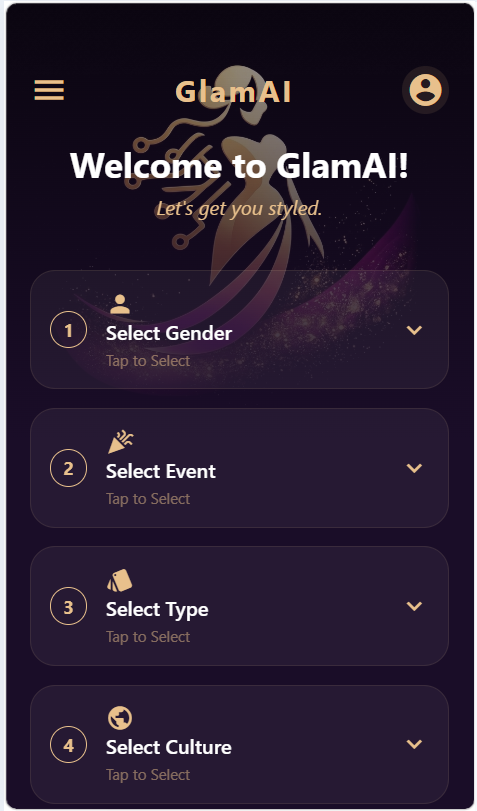

# GlamAI

GlamAI is an AI-powered beauty and fashion assistant application that helps users explore personalized style suggestions, beauty recommendations, and modern fashion trends using intelligent features.

## Features

- AI-based beauty recommendations
- Personalized fashion suggestions
- Modern responsive UI
- User-friendly interface
- Real-time style inspiration
- Fast and smooth performance

## Technologies Used

- React.js
- JavaScript
- React Native

## Installation

```bash
git clone https://github.com/Jeniber-jeya-j/GlamAI
cd glamAI
npm install
npx expo start
```

## Folder Structure

```bash
src/
│
├── context/
│   └── Stylecontext.js
│
├── navigation/
│   └── AppNavigator.js
│
├── screens/
│   ├── CategoryScreen.js
│   ├── Dashboardscreen.js
│   ├── HomeScreen.js
│   ├── PreviewScreen.js
│   ├── ProfileScreen.js
│   ├── ResultScreen.js
│   ├── Sidebar.js
│   ├── SplashScreen.js
│   ├── StyleScreen.js
│   └── UploadScreen.js
│
└── index.js

App.js
app.json
eas.json
package.json
```

## Screenshots

### Home Screen


### Welcome Screen


### Style Screen


### Result Screen


### Shop Screen


## Future Enhancements

- AI skin tone detection
- Virtual makeover feature
- AI chatbot assistant
- Product recommendations

## GitHub Repository

https://github.com/Jeniber-jeya-j/GlamAI

## Author

Jeniber Jeya
Frontend Developer